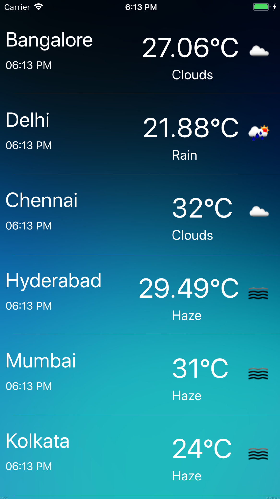
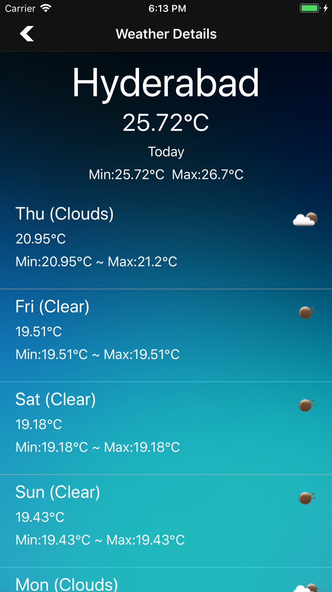

# README #

This README would normally document whatever steps are necessary to get your application up and running.

### What is this repository for? ###
* WeatherApp using http://openweathermap.org/forecast5 API. It is an application which list the weather of different cities and once the user selects a particular city it then shows the weather for the next 5 days of that particular city.
* WeatherApp using http://openweathermap.org/groups API to get the details of the city data.
* WeatherApp have dependencies of Cocoapods libraries ( AFNetworking, SDWebImage, SVProgressHUD).

### How do I get set up/Run in Local Meachine? ###

* Install Cocoapods libraries of ( AFNetworking, SDWebImage, SVProgressHUD).

 NOTE: As this is an assignment podfiles are already included in this repository. So, no need to install them again to run this app in simulator.

### How to install Cocoapods ###
* Open terminal and type:
 ~ sudo gem install -n /usr/local/bin cocoapods
 * After installation, there will be a lot of messages, read them and if no error found, it means cocoapods installation is done. Next, you need to setup the cocoapods master repo. Type in terminal:
 ~ pod setup 
 * Then in terminal cd to "your XCode project root directory" (where your .xcodeproj file resides) and type:
 ~ pod init
 * Then open your project's podfile by typing in terminal: 
 ~ open -a Xcode Podfile
 * Your Podfile will get open in text mode. Initially there will be some default commands in there. Here is where you add your project's dependencies. 
 ~ pod 'AFNetworking', pod 'SDWebImage', pod 'SVProgressHUD'
 * Then install pods into your project by typing in terminal:
 ~ pod install
 * Depending how many libraries you added to your podfile for your project, the time to complete this varies. Once completed, there will be a message that says.
 "Pod installation complete! There are X dependencies from the Podfile and X total pods installed."
 * Now close your xcode project and open .xcworkspace xcode project file and Run it. :)
 

 
### Screenshots ###

### Future implement's which take more time ###
* user can select any city by giving a additional mapview.
* In case of ipad we can use splitview for better UI.

